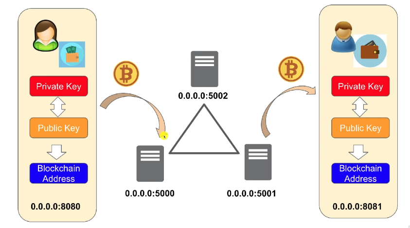
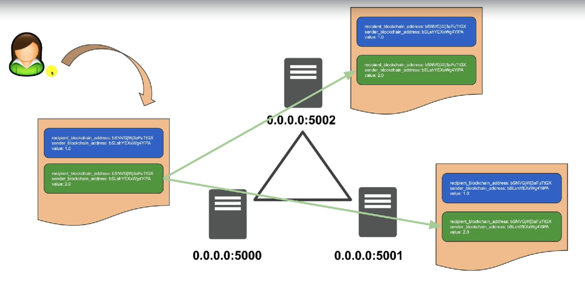

# cryptodemo

cryptodemo is a personal codification of udemy's "Golang: How to build a Blockchain in Go Guide" course

---

## Table of Contents
1. [Blockchain server](#blockchain-server)
2. [Wallet server](#wallet-server)
3. [Schemas](#blockchain-schemas)

---
## Blockchain server
### Start Server
```bash 
$ make blockchainserver
```

### URLs
|URL|Description|
|---|---|
|http://0.0.0.0:5000/transactions |List pending transaction to be added to blockchain|
|http://0.0.0.0:5000/chain|Returns the complete blockchain|
|http://0.0.0.0:5000/mine|Launch the mining process, so new block will be added to blockchain with pending transactions|
|http://0.0.0.0:5000/mine/start|Runs periodically the mine process if pending transactions exists|
|http://0.0.0.0:5000/mine/stop|Stops periodically mining process|
|http://0.0.0.0:5000/amount?blockchain_address=<blockchain_address>| Query the amount for <blockchain_address> address|
|http://0.0.0.0:5000/consensus|CONSENSUS!!|

---
## Wallet server
### Start Server
```bash 
$s make walletserver
```

### URLs

|URL|Description|
|---|---|
|http://0.0.0.0:8080/ | Access wallet frontpage|
|http://0.0.0.0:8080/wallet/amount?blockchain_address=<blockchain_address>| Query the amount for <blockchain_address> address|  

---

## Blockchain schemas 


### Multi Node Schema


### Synchronizing Transactions


---

---

## Start demo

To start demo, execute the following commands on separate terminals. 

The first ones will start blockchain servers

```bash
$ make run_docker_blockchainserver1
```
```bash
$ make run_docker_blockchainserver2
```
```bash
$ make run_docker_blockchainserver3
```
Note down the ips of the blockchain servers

After that start 2 walletservers, and connect each one to different blockchain server

```bash
$ make run_docker_walletserver1

Enter the blockchain server gateway: 
http://172.17.0.3:5000
```

```bash
$ make run_docker_walletserver2

Enter the blockchain server gateway: 
http://172.17.0.4:5000
```

private_key        a860ea4131380bbaf3a060e60cbdb985e5f1454e5e82a98c63df1db5eae02fd4

public_key         91777f4dbe7b6635236ada4fec2fdd02dbf1e48b8eca707f0f81f94febf99d261963e1b3753a9d3cb814d96927edfa4fe918d4c66d73512a3d6ec81ac084722d

blockchain_address 1LuSroD6wYXzzjwwrPg1FMiqnRTJnrW96H
