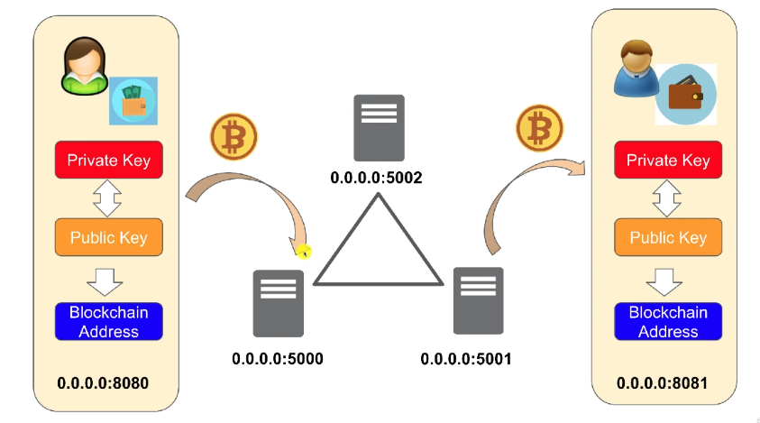

# cryptodemo

cryptodemo is the codification of udemy's "Golang: How to build a Blockchain in Go Guide" course

---

## Table of Contents
1. [Blockchain server](#blockchain-server)
2. [Wallet server](#wallet-server)
3. [Schemas](#blockchain-schemas)

---
## Blockchain server
### Start Server
```bash 
$ make blockchainserver
```

### URLs
|URL|Description|
|---|---|
|http://0.0.0.0:5000/transactions |List pending transaction to be added to blockchain|
|http://0.0.0.0:5000/chain|Returns the complete blockchain|
|http://0.0.0.0:5000/mine|Launch the mining process, so new block will be added to blockchain with pending transactions|
|http://0.0.0.0:5000/mine/start|Runs periodically the mine process if pending transactions exists|
|http://0.0.0.0:5000/mine/stop|Stops periodically mining process|
|http://0.0.0.0:5000/amount?blockchain_address=<blockchain_address>| Query the amount for <blockchain_address> address|

---
## Wallet server
### Start Server
```bash 
$s make walletserver
```

### URLs

|URL|Description|
|---|---|
|http://0.0.0.0:8080/ | Access wallet frontpage|
|http://0.0.0.0:8080/wallet/amount?blockchain_address=<blockchain_address>| Query the amount for <blockchain_address> address|  

---

## Blockchain schemas 

